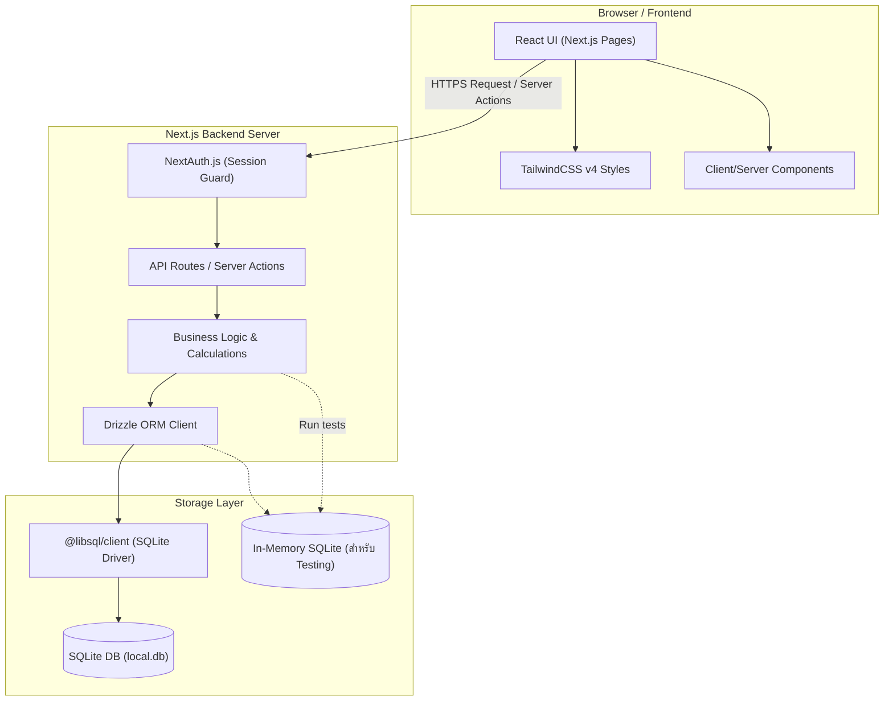
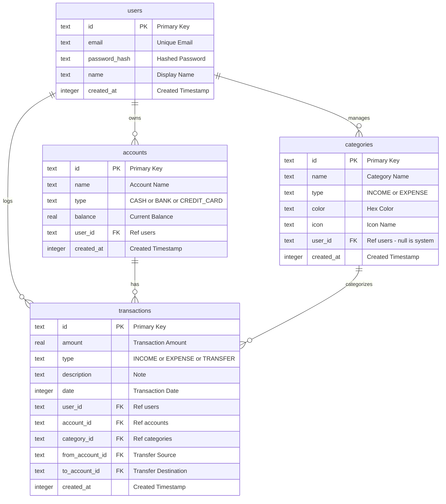
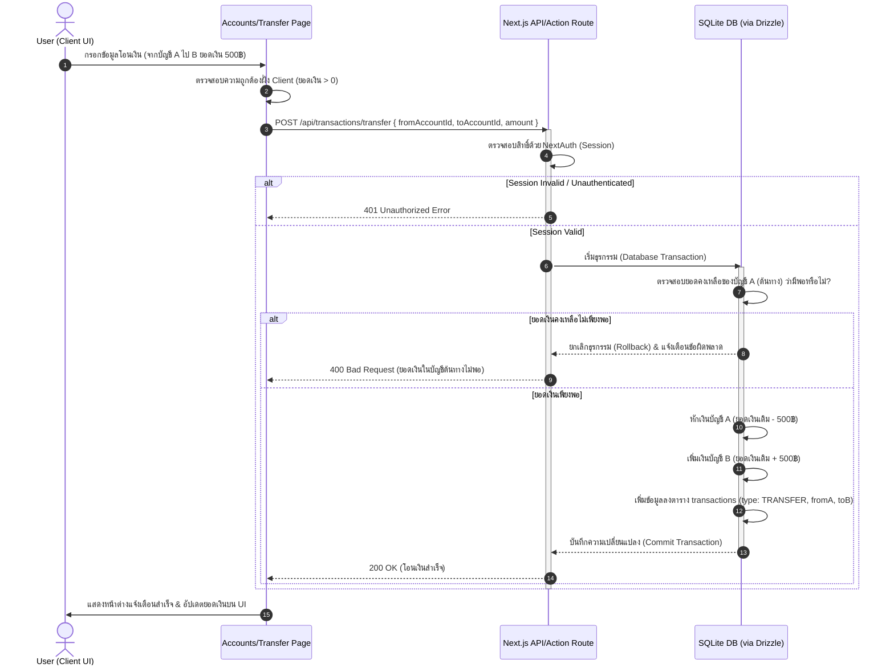

# System Architecture, ERD, and Sequence Diagrams

เอกสารนี้รวบรวมแผนภาพภาพรวมการทำงาน โครงสร้างฐานข้อมูล และขั้นตอนการทำงาน (Sequence) ของระบบบันทึกรายรับ-รายจ่ายที่สร้างขึ้นด้วย Next.js, Drizzle ORM และ SQLite

---

## 1. System Architecture Diagram

แผนภาพแสดงสถาปัตยกรรมการทำงานระดับแอปพลิเคชันจาก Frontend สู่ Database Layer:

---

## 2. Entity Relationship Diagram (ERD)

แผนภาพแสดงความสัมพันธ์ของข้อมูลใน SQLite ที่จัดการโดย Drizzle ORM:

---

## 3. Sequence Diagram (Money Transfer Flow)

แผนภาพแสดงลำดับการทำงานของฟีเจอร์การโอนเงิน (Transfer) ข้ามบัญชีธนาคาร:

